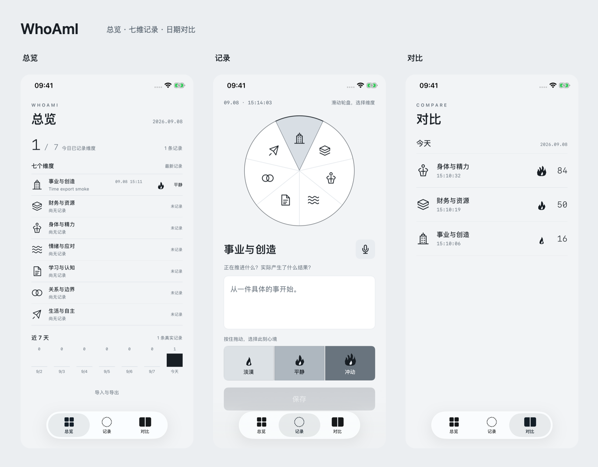

# WhoAmI

以第二视角，记录事实，检视判断。

原生 SwiftUI iOS Demo。冷白、石墨黑、钢灰；三个底部入口：**总览、记录、对比**。打开即可使用。



以上为 iPhone 16e 真实模拟器截图，展示不同测试状态。可查看[保存后开始新一条](design/screenshots/new-record-after-save.png)、[保存后的七维黑焰](design/screenshots/wheel-saved.png)、[输入与键盘](design/screenshots/record-keyboard.png)和[只读详情](design/screenshots/comparison-detail.png)。

## 当前交互

- **总览：**今日覆盖的维度、七维最新状态、最近七天记录活动。展示依据来自实际记录，最新摘要旁显示记录日期与时间。
- **记录：**约占屏幕三分之一的七等分轮盘，只显示七个自绘图标。轻点、横滑或沿轮盘拖动选择维度，正文区自动显示名称和引导问题。七个维度各自保留未保存的草稿。
- **心境：**按住三段渐深灰色能量条拖动，松手收起，只留下对应黑色火苗；轻点火苗可再次调整。1–33 淡漠、34–66 平静、67–99 冲动，数值在记录页隐藏。
- **保存：**每次保存生成一条含具体时间的新记录，随后清空当前正文与心境并回到轮盘。再次进入从新条目开始；重新输入相同内容也会形成独立记录。轮盘仅显示当天已记录维度的黑焰，跨午夜自动更新，历史保留。
- **对比：**按日期显示维度、具体时间（时:分:秒）、火焰和数值。点击查看正文与状态，详情只读。

旧版编辑框中已选心境、且与对应维度最新记录正文及心境完全一致的回填副本，会在升级时一次性清出；其余未保存草稿继续保留。历史记录不会回填至新条目。

心境是个人自评，不是模型推断。首次需要拖选心境再保存，不自动代填；旧记录没有数值时显示“—”。已有记录和旧草稿保留，新版存储兼容上一版 JSON。

## 导出与导入

在**总览底部 → 导入与导出**，选择今天、指定日期或全部记录，然后选择文件格式：

- **Markdown**：按固定结构整理时间、维度、心境与正文，适合直接交给 AI 分析。
- **JSON**：带版本号的记录档案，保留记录 ID、带时区的毫秒时间、原文和心境，可重新导入。

点击导出会打开 iOS 系统分享面板，可存储到“文件”，或发送至微信等已安装并提供分享扩展的 App。JSON 导入通过系统文件选择器完成；按 ID 合并，已有记录优先，重复导入不会多记一份。导入失败不会修改已有数据。

仅导出**已保存的记录**，不包含未提交草稿。Markdown 用于阅读，恢复记录使用 JSON；范围和字段见 [固定文件格式](design/记录导入导出格式.md)。新版不再生成示例，升级时只移除明确标记为示例的条目，个人记录和草稿保留。

[导入导出界面](design/screenshots/data-transfer.png) · [系统文件分享](design/screenshots/system-share.png)

## 语音

记录页麦克风按钮使用 Apple Speech 与 AVAudioEngine，将语音转成可编辑文字。仅点按语音时请求系统麦克风和语音识别权限。

支持设备端识别时优先设备端处理；其他设备可能使用 Apple 语音识别服务。系统权限被拒绝、音频不可用或识别服务不可用时，会给出状态说明，仍可打字。语音没有接入独立云端模型，也不持久保存原始音频。

## Xcode 运行

1. 打开 `WhoAmI.xcodeproj`。
2. 选择 `WhoAmI` Scheme 和 iPhone 模拟器，运行。
3. 真机调试选择自己的签名 Team；语音识别建议在真机验证。

支持 iOS 17+，以 iPhone 竖屏、浅色主题为主。无第三方包依赖。

```sh
xcodebuild -project WhoAmI.xcodeproj -scheme WhoAmI \
  -destination 'platform=iOS Simulator,name=iPhone 16e' \
  -derivedDataPath build/DerivedData CODE_SIGNING_ALLOWED=NO build
```

```sh
xcodebuild -project WhoAmI.xcodeproj -scheme WhoAmI \
  -destination 'platform=iOS Simulator,name=iPhone 16e' \
  -derivedDataPath build/DerivedData -parallel-testing-enabled NO \
  CODE_SIGNING_ALLOWED=NO test
```

测试会重置专用测试模拟器中的本 App 数据。运行结果、当前截图及未覆盖范围见 [验证记录](design-qa.md)。

v0.3 轮盘版完整 UI 测试 **4/4 通过**，布局相关复测 **2/2 通过**。v0.3.1 的25个不同测试用例全部通过，真机升级前后逐字段核对也通过，见 [导入导出验证](design/导入导出验证.md)。v0.3.2 的36项测试全部通过，连续新条目和当日轮盘验证见 [本轮验证](design/独立记录验证.md)。语音转写尚未进行真机实测。

## 实现

- `DimensionRecordView`：七页内容、语音转写、心境与保存流程。
- `ObservationControls`：轮盘、自绘七维图标、三档动态火焰与拖动能量条。
- `DashboardView` / `ComparisonView`：总览与只读对比。
- `SpeechRecorder`：按需权限、语音识别与音频会话清理。
- `RecordArchive` / `DataTransferView`：固定 Markdown/JSON 格式、日期筛选、系统分享与 JSON 导入。
- `AppStore`：本地 JSON、独立草稿、历史快照及旧版数据兼容。

AI 分析、云同步和后台提醒尚未实现。旧版日记/复盘/档案视图代码保留，但不再作为底栏入口。

- [项目描述](项目描述.md)
- [UI 设计说明](design/UI设计说明.md)
