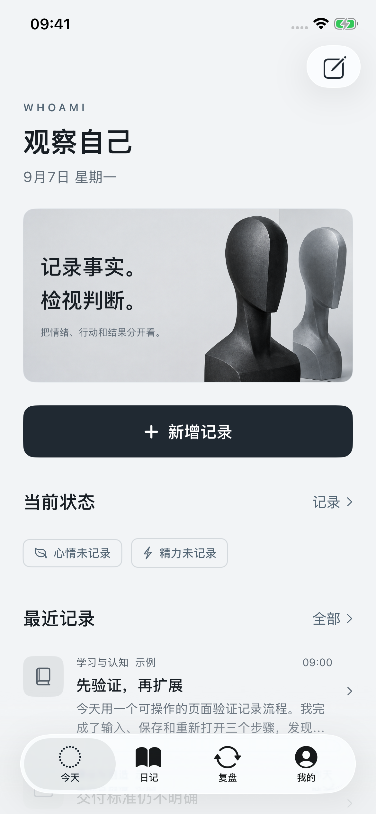
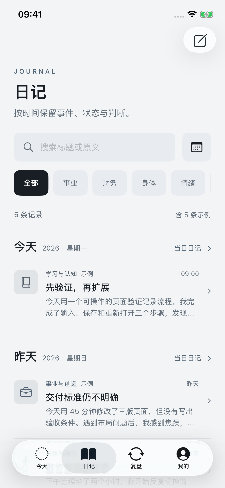
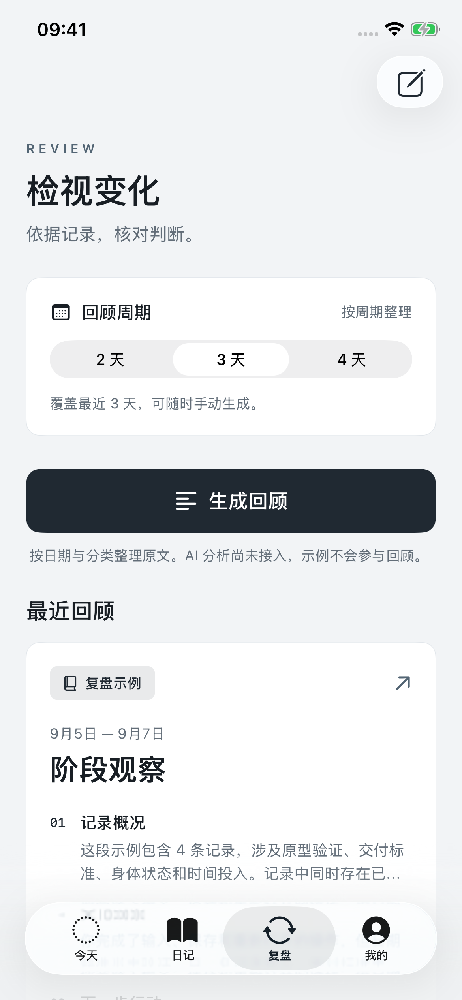
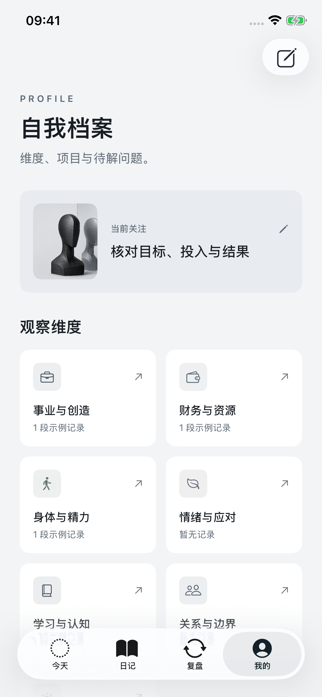

# WhoAmI

以第二视角，记录事实，检视判断。

一款原生 SwiftUI iPhone App 的可交互 UI 首版：记录事件、阅读日记、检视阶段变化，并管理自己的成长方向。打开即可使用，无登录、邀请码、订阅墙或配置门槛。

## 界面预览

冷白、石墨黑与钢灰；直接、克制的观察者语气。以下为真实 iPhone 模拟器截图，内容均为示例。

[查看四屏总览](design/screenshots/overview.png)

| 今天 | 日记 | 复盘 | 我的 |
| --- | --- | --- | --- |
|  |  |  |  |

## 已实现

- **随手记录：**正文、选填分类/心情/项目，自动保留未完成草稿，本地保存。
- **日记：**按日期浏览、全文搜索、维度和日期筛选、当日整理、记录编辑和删除。
- **状态：**心情、精力自评，可同步留在当日日记。
- **复盘：**2/3/4 天周期、本地原文回顾、示例报告、原文跳转、行动与反馈保存。
- **个人档案：**七个观察维度、当前重视事项、项目与问题的增改查删。
- **数据：**重启后保留、JSON 导出、示例与真实内容区分、清除示例。

**AI 尚未接入。** 当前日记整理与回顾按本地记录的日期和分类组织，不推断个人动机。示例报告明确标记，真实回顾排除示例。没有服务端、云同步或后台定时通知。

## 在 Xcode 中运行

1. 打开 `WhoAmI.xcodeproj`。
2. 选择 `WhoAmI` Scheme 和 iPhone 模拟器，运行。
3. 真机运行时选择自己的签名 Team；使用模拟器不需要配置账号。

支持 iOS 17+，当前以 iPhone 竖屏、浅色主题为主。开发环境为 Xcode 26.3，无外部 Swift Package 或 CocoaPods 依赖。

```sh
xcodebuild -project WhoAmI.xcodeproj -scheme WhoAmI \
  -destination 'platform=iOS Simulator,name=iPhone 17 Pro' \
  -derivedDataPath build/DerivedData CODE_SIGNING_ALLOWED=NO build
```

## 验证

5 个 UI 测试覆盖记录与重启持久化、草稿恢复、四个 Tab 与复盘原文跳转、编辑取消/保存/删除，以及真实记录回顾和反馈保存。

```sh
xcodebuild -project WhoAmI.xcodeproj -scheme WhoAmI \
  -destination 'platform=iOS Simulator,name=iPhone 17' \
  -derivedDataPath build/DerivedData -parallel-testing-enabled NO \
  CODE_SIGNING_ALLOWED=NO test
```

UI 测试会重置**测试模拟器内的本 App 数据**；请使用专门的测试模拟器。实际验证结果与截图见 [design-qa.md](design-qa.md)。

## 项目结构

```text
WhoAmI/
  App/          App 入口与原生导航
  Design/       色彩、字体层级和共享组件
  Models/       数据模型、本地存储与示例
  Views/        今天、编辑器、日记、复盘和档案
  Resources/    观察者雕塑与 App 图标
WhoAmIUITests/ 交互回归测试
design/        设计说明、视觉参考与真实截图
tools/         无第三方依赖的 Xcode 工程生成脚本
```

Xcode 工程已经提交，可直接打开。增删 Swift 文件后，可运行 `python3 tools/generate_project.py` 重新生成文件引用。

- [项目描述](项目描述.md)
- [UI 设计说明](design/UI设计说明.md)
- [视觉与交互验证](design-qa.md)
